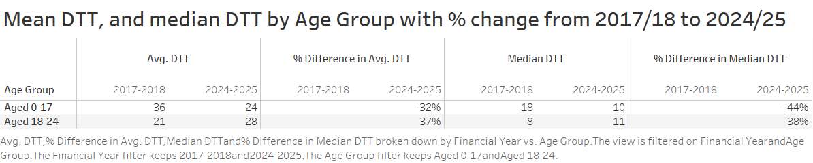
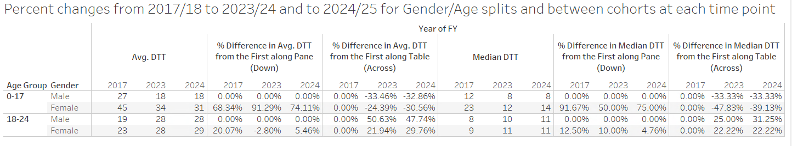
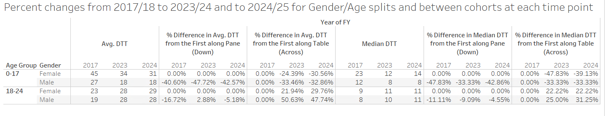
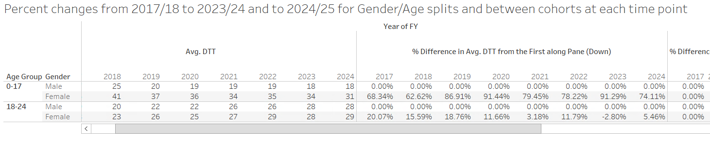

```{r setup}
library(targets)
library(tidyverse)
library(scales)

# Reset any knitr chunk options to defaults
knitr::opts_chunk$set()

# Reset all hooks
knitr::knit_hooks$set()

# Set autoprint option so that plots are automatically printed for Heather
knitr::opts_chunk$set(autoprint = TRUE)

source("R/quarto_formatting.R")

# Custom knitr hook to auto print `tar_read()` results so Heather can render
knitr::knit_hooks$set(output = function(x, options) {
  if (grepl("tar_read", x)) {
    paste0("print(", x, ")")
  } else {
    x
  }
})
```

## Introduction

The analysis in this report was commissioned by CQC to support a special interest report on the Mental Health Act (MHA) and children and young people (CYP). A separate report is being published alongside this that looks into the use of acute emergency services (ED and UCC) by CYP presenting with mental health issues.

The purpose of this analysis is to explore how detentions under the MHA for CYP (covering ages 0-24) vary over time, according to population sub-groups and in different areas of the country. Of particular interest are the nature of 'conversions' between different sections of the act; of variation in whole detention length of stay; levels of re-detention; clinical outcomes (HONOS) and the distances patients are admitted to beds away from home (all admissions, not just MHA).

NHS Digital publishes various data and reports on the MHA [(https://digital.nhs.uk/data-and-information/publications/statistical/mental-health-act-statistics-annual-figures)](https://digital.nhs.uk/data-and-information/publications/statistical/mental-health-act-statistics-annual-figures). The analysis commissioned and produced for this report is either novel in it's entirety or in the cross-tabulation of characteristics used to explore a known topic to a greater degree.

## Data and methods

All of the analysis in this report is sourced from the Mental Health Services Data Set (MHSDS). Data relating to MHA detention episodes are taken from MHS401 tables and all MH inpatient admissions from MHS501/MHS502. Administrative and demographic data were linked from the MHS001 (MPI) tables. As the MHSDS is a cumulative dataset with multiple submissions of the same activity data was de-duplicated taking the latest and fullest submission of data for a particular detention episode or admission.

In general, whilst things have improved over time, there are persistent data quality issues with submissions to the MHSDS in terms of coverage, completion and consistency of data available for secondary analysis. Additionally, the [cyber incident](https://digital.nhs.uk/data-and-information/publications/statistical/learning-disability-services-statistics/at-october-2022-mhsds-august-2022-final/data-quality---mhsds) from 2022 may still impact on the submissions from a number of providers across the country. Submissions from independent sector providers are also thought to be affected more by data completion and data quality issues.

In order to evaluate detention 'pathways', length of stay and re-detention we compiled MHA spells where all detention episodes were knitted together for individual patients where explicitly a transfer or where successive episodes were date-matched. A tolerance of 1 day between previous detention end and subsequent detention start was permitted on date-matching due to high volumes of episodes of this nature, the likelihood that these episodes are connected (or should be) and to allow for lags in data systems/submissions.

## Summary findings

### Conversions between sections of the Mental Health Act

```{r conversions summary numbers}
number_detentions <- tar_read(conversion_map_cyp) |> 
  summarise(spells = sum(spells)) |> 
  pull(spells)

number_single_episode_detentions <- tar_read(conversion_map_cyp) |>
  filter(epi_count == 1) |> 
  summarise(spells = sum(spells)) |> 
  pull(spells)

number_multi_episode_detentions <- tar_read(conversion_map_cyp) |>
  filter(epi_count > 1) |> 
  summarise(spells = sum(spells)) |> 
  pull(spells)

perc_single_episode_detentions <- janitor::round_half_up(number_single_episode_detentions * 100 / number_detentions, 2)

get_top_path_from_section <- function(data){
  
  top_from <- data |>
    head(1) 
  
  top_from_perc <- top_from |>
    dplyr::pull(perc) |>
    janitor::round_half_up(2)
  
  path <- top_from |>
    dplyr::pull(first_two_sections) |>
    stringr::str_split("-") |>
    unlist()
  
  top_from_path <- ifelse(length(path) == 1, 
                          "not converted", 
                          glue::glue("converted to Section {path[2]}"))
  
  return(list(perc = top_from_perc,
         path = top_from_path))
  
}
```

-   The majority (`r perc_single_episode_detentions`%) of Mental Health Act Detention spells are single episode detentions.
-   The most common pathway during a multi-episode detention spell is being detained under Section 2 then Section 3.
-   There are more Section 3 renewals for 0-17 year olds compared to 18-25 year olds.
-   Just under half of all detentions for CYP start off as short-term (sections 136, 4, 5(2) and 5(4)) compared to under one third for adults.
-   The number of Section 136 detentions appear to be reducing over time.
-   There are more conversions from Section 136 to Section 2 for males compared to females, for 18-24 year olds compared to under 18s, for black patients compared to all other ethnic groups combined and for patients from areas with low IMD quantiles compared to high quantiles.
-   There are more conversions from Section 5(2) to Section 2 for 0-17 year olds compared to 18-25 year olds and for females compared to males.
-   The majority (`r get_top_path_from_section(tar_read(mha_conv_from_4)$summary)$perc`%) of Mental Health Act Detention spells starting under Section 4 are `r get_top_path_from_section(tar_read(mha_conv_from_4)$summary)$path`.
-   `r get_top_path_from_section(tar_read(mha_conv_from_52)$summary)$perc`% of Mental Health Act Detention spells starting under Section 5(2) are `r get_top_path_from_section(tar_read(mha_conv_from_52)$summary)$path`.
-   The majority (`r get_top_path_from_section(tar_read(mha_conv_from_54)$summary)$perc`%) of Mental Health Act Detention spells starting under Section 5(4) are `r get_top_path_from_section(tar_read(mha_conv_from_54)$summary)$path`.
-   The majority (`r get_top_path_from_section(tar_read(mha_conv_from_136)$summary)$perc`%) of Mental Health Act Detention spells starting under Section 136 are `r get_top_path_from_section(tar_read(mha_conv_from_136)$summary)$path`.
-   For detention spells starting under s.136, the conversion to other sections varies across the country from 6% (Lincolnshire) to 43% (Bristol & North Somerset).

### Mental Health Act Detention Spell Length of Stay

```{r los summary numbers}
los_median_23_24 <- tar_read(cyp_los_median) |>
  dplyr::filter(der_financial_year == "2023/24") |>
  dplyr::summarise(median = median(value)) |>
  dplyr::pull()

los_female_23_24 <- tar_read(cyp_los_plot_gender)$table |>
  dplyr::filter(der_financial_year == "2023/24", gender == "female") |>
  dplyr::pull(value)

los_male_23_24 <- tar_read(cyp_los_plot_gender)$table |>
  dplyr::filter(der_financial_year == "2023/24", gender == "male") |>
  dplyr::pull(value)

los_0_17_23_24 <- tar_read(cyp_los_plot_age_group)$table |>
  dplyr::filter(der_financial_year == "2023/24", age_group == "0-17") |>
  dplyr::pull(value)

los_18_24_23_24 <- tar_read(cyp_los_plot_age_group)$table |>
  dplyr::filter(der_financial_year == "2023/24", age_group == "18-24") |>
  dplyr::pull(value)
```

-   Most lengths of Mental Health Act detention spells are up to 1 day long with another (smaller) peak at around 28 days.
-   Median length of stay varies by ICB and has increased over time to `r los_median_23_24` days in 2023/24.
-   Typically only 1-2% of all CYP detention spells last longer than 1 year.
-   Over time, the median length of stay is consistently higher for males compared to females. In 2023/24, the median length of stay for males and females was `r los_male_23_24` and `r los_female_23_24` days respectively.
-   Median length of stay is higher for under 18s (`r los_0_17_23_24` days) compared to 18-24 year olds (`r los_18_24_23_24` days). For the 18-24 age group, the median length of stay has increased over time.
-   Median length of stay is lower for white patients compared to patients from all other ethnic groups combined.
-   Median length of stay is lower for patients from the most deprived areas compared to all other groups.
-   Length of stay varies by the first section of the MHA that the patient is detained under. Patients first detained under section 2 and section 3 typically have lengths of stay up to 28 days and 365 days respectively. Patients first detained under sections 135 or 136, typically have lengths of stay up to 1 day long.

### Mental Health Act Re-detentions

```{r redetentions summary numbers}
redetention_female_23_24 <- tar_read(cyp_redetentions_plot_gender)$table |>
  dplyr::filter(der_financial_year == "2022/23", gender == "female") |>
  dplyr::pull(perc) |>
  janitor::round_half_up(2)

redetention_male_23_24 <- tar_read(cyp_redetentions_plot_gender)$table |>
  dplyr::filter(der_financial_year == "2022/23", gender == "male") |>
  dplyr::pull(perc) |>
  janitor::round_half_up(2)


readmissions_23_24 <- tar_read(cyp_readmissions_perc) |>
  dplyr::filter(der_financial_year == "2022/23") |>
  dplyr::pull(perc) |>
  janitor::round_half_up(2)
```

-   Almost half of MHA detentions had a redetention within 12 months and this level is fairly consistent over time. However; this varies by ICB area from 18% (Leicestershire) to 72% (Shropshire & Telford).
-   The percentage of MHA detentions with a MHA redetention within 12 months is higher for females than males. In 2022/23, this was `r redetention_female_23_24`% for females and `r redetention_male_23_24`% for males.
-   The percentage of MHA detentions with a MHA redetention within 12 months is higher for 18-24 year olds compared to under 18s over time.
-   The percentage of MHA detentions with a MHA redetention within 12 months is higher for white patients compared to patients from all other ethnic groups combined.
-   The percentage of MHA detentions with a MHA redetention within 12 months for patients from the most deprived areas compared to all other groups.
-   These patterns are the inverse of the patterns found for the length of stay of MHA detention spells.
-   The percentage of MHA detentions that had a subsequent MH inpatient admission within 12 months has increased to `r readmissions_23_24`% in 2022/23.

### Clinical Outcomes (HONOS scores)

```{r honos summary numbers}
honos_flow_perc <- tar_read(honos_flow_perc)

number_spells <- honos_flow_perc |>
  dplyr::filter(stage == 'spells') |>
  dplyr::pull(number)

perc_honos_assess <- honos_flow_perc |>
  dplyr::filter(stage == 'honos_assessments') |>
  dplyr::pull(perc)

perc_last_assess <- honos_flow_perc |>
  dplyr::filter(stage == 'first_and_last_assessments') |>
  dplyr::pull(perc)

honos_perc_worse <- tar_read(honos_perc_worse) |> 
  dplyr::pull(perc_worse) |> 
  janitor::round_half_up(2)
```

-   Data recording (in the MHSDS) is poor for assessment outcomes for both children and adults. HONOS is the most common assessment tool, though others are used sporadically.
-   Of all CYP MH spells that ended between 1st April 2018 and 31st March 2023, `r perc_honos_assess`% had at least 1 full HONOS assessment.
-   Only `r perc_last_assess`% of CYP MH spells had a full HONOS assessment within 7 days of the start **and** another within 7 days of the end of the spell.
-   Though numbers are small, from those that did have assessments at start and end of spell around 50% demonstrated an improvement (reduction) and 20% a deterioration (increase) in HONOS scores. The remainder demonstrated no change in scores.

### Distance from home to bed (all detentions and admissions)

-   There has been a small increase over time in mean distance CYP are admitted from home. This is accompanied by a decreasing trend in admissions numbers suggest capacity issues.
-   The median distance however is constant over time, suggesting then an increase in mainly the furthest distances are skewing the mean.
-   The population groups most affected (in relative terms) by increased distance from home are males, those aged 18-24, those in ‘other’ minority ethnic groups and those in deprived populations.
-   Deprived populations however on average travel smaller distances due to proximity to services.
-   As expected, more urban ICB areas have lower average distances from inpatient beds to home than rural ICBs. The distances are increasing for rural areas however suggesting greater access/capacity challenges in those places and more CYP travelling out of area.

## Detailed MHA analysis

### 'Conversions' between section of the act {#sec-conversions}

#### Background

Most people who are detained under the MHA undergo an assessment within a defined period, and are then either discharged from detention or are kept on for treatment under a different section of the act. Some may have their treatment detentions renewed or switched to alternative section if not deemed safe to be discharged to self or community care.

The following analysis provides a high-level summary, for patients aged under 25 in England, of the most common detention pathways. In order to undertake this analysis, 'detention spells' were constructed in sql to knit together linked detention episodes. This same data is used in our length of stay and re-detention analysis to cover the entire period a patient was detained and not just the individual episodes as recorded in the MHSDS.

#### Single and multi-episode detentions

Across the 5 year period to 2023/24, there were `r number_detentions` detention spells in those aged under 25 at time of detention.

Of these, `r number_single_episode_detentions` were single episode detentions whereas `r number_multi_episode_detentions` had more than one detention episodes.

#### Most common 'pathways' during a detention spell

For those spells containing more than 1 detention episode, the following are the most common (top ten) in CYP over time:

```{r}
tar_read(conversion_map) |> 
  filter(age_group != '25+', epi_count > 1) |>
  group_by(fin_year, sections_all) |> 
  summarise(spells = sum(spells)) |> 
  pivot_wider(names_from = fin_year, values_from = spells) |> 
  arrange(desc(`2023-2024`)) |> 
  head(10) |>
  create_dt()
```

#### Specific pathways of interest by population sub-group

The following analysis quantifies the scale of certain subset of conversions within detention spells. The list of conversions was specified by the CQC team. In these plots, the percentage of detention spells containing at least one instance of the specific sequence of conversions is shown. These are not exclusive categories since a spell can have multiple conversions. For example, a spell like "5(2)-3-3" will be counted in the "Section 5(2) to Section 3" and "Section 3 renewal" categories.

::::::: panel-tabset
##### Age group

::: panel-tabset
###### Chart

```{r}
#| label: fig-conversion_age
#| fig-cap: Frequency of specific multi-episode pathways by age groups, 2019/20 to 2023/24.
tar_read(mha_conv_age_plot)
```

###### Table

```{r}
#| label: fig-conversion_age_tab

tar_read(mha_conv_age_tab) |> 
  create_dt()
```
:::

##### Gender

::: panel-tabset
###### Chart

```{r}
#| label: fig-conversion_sex
#| fig-cap: Frequency of specific multi-episode pathways by gender, 2019/20 to 2023/24.

tar_read(mha_conv_sex_plot)
```

###### Table

```{r}
#| label: fig-conversion_sex_tab

tar_read(mha_conv_sex_tab) |> 
  create_dt()
```
:::

##### Ethnic category

::: panel-tabset
###### Chart

```{r}
#| label: fig-conversion_eth
#| fig-cap: Frequency of specific multi-episode pathways by ethnic category, 2019/20 to 2023/24.

tar_read(mha_conv_eth_plot)
```

###### Table

```{r}
#| label: fig-conversion_eth_tab

tar_read(mha_conv_eth_tab) |> 
  create_dt()
```
:::

##### IMD quantile

::: panel-tabset
###### Chart

```{r}
#| label: fig-conversion_imd
#| fig-cap: Frequency of specific multi-episode pathways by IMD quantile, 2019/20 to 2023/24.

tar_read(mha_conv_imd_plot)
```

###### Table

```{r}
#| label: fig-conversion_imd_tab

tar_read(mha_conv_imd_tab) |> 
  create_dt()
```
:::
:::::::

#### Conversions from MHA detentions starting under specific Sections

Sections 4, 5(2), 5(4) and 136 of the MHA are short-term detentions to allow for a MHA assessment to take place before the patient is either detained under another section of the MHA or discharged. The following analysis concerns MHA detentions starting under Sections 4, 5(2), 5(4) and 136 and the subsequent non-conversions or conversions to Section 2, Section 3 or other sections of the MHA.

Please note that due to low numbers of spells for some of the analyses below, only the number of spells has been removed from the affected tables. In these cases an extra column has been added to the tables to flag where the number of spells was less than or equal to 5 to help with the interpretation of percentages, since for example a very high percentage may be due to the low number of spells.

##### Section 4

::: panel-tabset
###### Chart

```{r}
#| label: fig-conversion-4
#| fig-cap: Percentage of conversions of spells starting with a MHA detention under Section 4.
tar_read(mha_conv_from_4)$plot
```

###### Table

```{r}
#| label: tbl-conversion-4
#| tbl-cap: Percentage of conversions of spells starting with a MHA detention under Section 4.

tar_read(mha_conv_from_4)$table |> 
  create_dt()
```

###### Summary

```{r}
#| label: tbl-conversion-4-summary
#| tbl-cap: Summary of conversions from a MHA detention under Section 4 from 2019/20 to 2023/24.

tar_read(mha_conv_from_4)$summary |> 
  create_dt()
```
:::

::: panel-tabset
###### Map

```{r}
#| label: fig-conversion-4-map
#| fig-cap: Percentage of spells starting with a MHA detention under Section 4 that were converted to either Section 2 or Section 3.

tar_read(mha_conv_from_4_map)$map +
  ggplot2::labs(caption = "Grey areas for ICBs that had no spells starting with Section 4.")
```

###### Table

```{r}
#| label: tbl-conversion-4-map
#| tbl-cap: Percentage of spells starting with a MHA detention under Section 4 that were converted to either Section 2 or Section 3.

tar_read(mha_conv_from_4_map)$table |> 
  create_dt()
```
:::

##### Section 5(2)

::: panel-tabset
###### Chart

```{r}
#| label: fig-conversion-52
#| fig-cap: Percentage of conversions of spells starting with a MHA detention under Section 5(2).

tar_read(mha_conv_from_52)$plot
```

###### Table

```{r}
#| label: tbl-conversion-52
#| tbl-cap: Percentage of conversions of spells starting with a MHA detention under Section 5(2).

tar_read(mha_conv_from_52)$table |> 
  create_dt()
```

###### Summary

```{r}
#| label: tbl-conversion-52-summary
#| tbl-cap: Summary of conversions from a MHA detention under Section 5(2) from 2019/20 to 2023/24.

tar_read(mha_conv_from_52)$summary |> 
  create_dt()
```
:::

::: panel-tabset
###### Map

```{r}
#| label: fig-conversion-52-map
#| fig-cap: Percentage of spells starting with a MHA detention under Section 5(2) that were converted to either Section 2 or Section 3.

tar_read(mha_conv_from_52_map)$map
```

###### Table

```{r}
#| label: tbl-conversion-52-map
#| tbl-cap: Percentage of spells starting with a MHA detention under Section 5(2) that were converted to either Section 2 or Section 3.

tar_read(mha_conv_from_52_map)$table |> 
  create_dt()
```
:::

##### Section 5(4)

::: panel-tabset
###### Chart

```{r}
#| label: fig-conversion-54
#| fig-cap: Percentage of conversions of spells starting with a MHA detention under Section 5(4).

tar_read(mha_conv_from_54)$plot
```

###### Table

```{r}
#| label: tbl-conversion-54
#| tbl-cap: Percentage of conversions of spells starting with a MHA detention under Section 5(4).

tar_read(mha_conv_from_54)$table |> 
  create_dt()
```

###### Summary

```{r}
#| label: tbl-conversion-54-summary
#| tbl-cap: Summary of conversions from a MHA detention under Section 5(4) from 2019/20 to 2023/24.

tar_read(mha_conv_from_54)$summary |> 
  create_dt()
```
:::

::: panel-tabset
###### Map

```{r}
#| label: fig-conversion-54-map
#| fig-cap: Percentage of spells starting with a MHA detention under Section 5(4) that were converted to Section 2, Section 3 or Section 5(2).

tar_read(mha_conv_from_54_map)$map
```

###### Table

```{r}
#| label: tbl-conversion-54-map
#| tbl-cap: Percentage of spells starting with a MHA detention under Section 5(4) that were converted to either Section 2, Section 3 or Section 5(2).

tar_read(mha_conv_from_54_map)$table |> 
  create_dt()
```
:::

##### Section 136

::: panel-tabset
###### Chart

```{r}
#| label: fig-conversion-136
#| fig-cap: Percentage of conversions of spells starting with a MHA detention under Section 136.

tar_read(mha_conv_from_136)$plot
```

###### Table

```{r}
#| label: tbl-conversion-136
#| tbl-cap: Percentage of conversions of spells starting with a MHA detention under Section 136.

tar_read(mha_conv_from_136)$table |> 
  create_dt()
```

###### Summary

```{r}
#| label: tbl-conversion-136-summary
#| tbl-cap: Summary of conversions from a MHA detention under Section 136 from 2019/20 to 2023/24.

tar_read(mha_conv_from_136)$summary |> 
  create_dt()
```
:::

::: panel-tabset
###### Map

```{r}
#| label: fig-conversion-136-map
#| fig-cap: Percentage of spells starting with a MHA detention under Section 136 that were converted to either Section 2 or Section 3.

tar_read(mha_conv_from_136_map)$map
```

###### Table

```{r}
#| label: tbl-conversion-136-map
#| tbl-cap: Percentage of spells starting with a MHA detention under Section 136 that were converted to either Section 2 or Section 3.

tar_read(mha_conv_from_136_map)$table |> 
  create_dt()
```
:::

#### MHA detentions with Section 2 to Section 3 pathways

This is all completed MHA detention spells between 2019/20 and 2023/24 containing a conversion from Section 2 to Section 3. This includes detentions starting under any section of the MHA and spells with any number or pattern of sections, including renewals of sections.

::: panel-tabset
##### Map

```{r}
#| label: fig-conversion-2-to-3
#| fig-cap: Spells containing a conversion from Section 2 to Section 3.
tar_read(mha_conf_from_2_to_3)$map  +
  ggplot2::labs(caption = "Grey areas for ICBs that had no spells containing a conversion from Section 2 to Section 3.")
```

##### Table

```{r}
#| label: tbl-conversion-2-to-3
#| tbl-cap: Spells containing a conversion from Section 2 to Section 3.
tar_read(mha_conf_from_2_to_3)$table |>
  create_dt()
```
:::

### Mental Health Act Detention Spell Length of Stay {#sec-los}

A MHA detention spell can consist of consecutive MHA detentions so the length of stay is defined as the difference in time between the start of the first MHA detention in a spell to the spell discharge date.

In 2023/24, the distribution of MHA detention spells length of stay is right-skewed with the majority being 1 day long (@fig-los-histo). There is also a small peak in the distribution at about day 27, probably a result of detentions under section 2 of the MHA being limited to up to 28 days (@fig-los-histo-zoomed).

Across the 5 years to 2023/24, around 45% of children and young people detained started off with short-term detentions (sections 136, 4, 5(2) and 5(4)). The equivalent for adults over the same period is 30%.

```{r}
llos_perc <- tar_read(cyp_llos_perc)
```

Of the `r llos_perc |> dplyr::pull(count)` MHA detention spells in 2023/24, `r llos_perc |> dplyr::pull(perc_llos) |> janitor::round_half_up(2)`% were longer than 365 days. Most of these long spells were due to consecutive detentions under Section 3 of the MHA.

::: panel-tabset
#### All LoS

```{r}
#| label: fig-los-histo
#| fig-cap: Histogram of lengths of MHA detention spells for 2023/24.
tar_read(cyp_los_histo)
```

#### LoS \< 30 days

```{r}
#| label: fig-los-histo-zoomed
#| fig-cap: Histogram of lengths of MHA detention spells less than 30 days for 2023/24.
tar_read(cyp_los_histo_zoomed)
```
:::

The median length of MHA detention spell has increased (@fig-los-mh) over time to `r los_median_23_24` days in 2023/24. This varies by ICB (@tbl-los-icb).

::: panel-tabset
##### Overview

```{r}
#| label: fig-los-mh
#| fig-cap: Median length of Mental Health Act detention spell.
tar_read(cyp_los_boxplot)  +
  ggplot2::labs(y = "Median length of MHA detention spell",
                title = "Median length of MHA detention spell",
                subtitle = "England 2019/20 to 2023/24 by ICB")
```

##### Summary

```{r}
#| label: tbl-los-summary
#| tbl-cap: Summary of median length of Mental Health Act detention spell.
tar_read(cyp_los_median) |>
  get_quantiles_and_mean()
```

##### ICB Variation

```{r}
#| label: tbl-los-icb
#| tbl-cap: Median length of Mental Health Act detention spell by ICB.
tar_read(cyp_los_median_table) |>
  color_gradient(c("2019/20", "2020/21", "2021/22", "2022/23", "2023/24"), 
                 seq(0, 39, 5))
```
:::

Median length of stay for MHA detention spells are higher for males compared to females, higher for under 18s compared to 18-24 year olds and also show ethnic group and socioeconomic variation.

:::::::: panel-tabset
##### Overview

::: panel-tabset
###### Chart

```{r}
#| label: fig-los-line
#| fig-cap: Median length of MHA detention over time.
tar_read(cyp_los_plot_overview)$plot
```

###### Table

```{r }
tar_read(cyp_los_plot_overview)$table |>
  create_dt()
```
:::

##### Gender variation

::: panel-tabset
###### Chart

```{r los_gender_plot}
#| label: fig-los-gender
#| fig-cap: Median length of MHA detention over time by gender.
tar_read(cyp_los_plot_gender)$plot
```

###### Table

```{r los_gender_table}
tar_read(cyp_los_plot_gender)$table |>
  create_dt()
```
:::

##### Age-group variation

::: panel-tabset
###### Chart

```{r los_age_plot}
#| label: fig-los-age
#| fig-cap: Median length of MHA detention over time by age group.
tar_read(cyp_los_plot_age_group)$plot
```

###### Table

```{r los_age_table}
tar_read(cyp_los_plot_age_group)$table |>
  create_dt()
```
:::

##### Ethnic group variation

::: panel-tabset
###### Chart

```{r los_ethnic_plot}
#| label: fig-los-ethnic
#| fig-cap: Median length of MHA detention over time by ethnic category.
tar_read(cyp_los_plot_ethnic_category)$plot
```

###### Table

```{r los_ethnic_table}
tar_read(cyp_los_plot_ethnic_category)$table |>
  create_dt()
```
:::

##### Socioeconomic variation

::: panel-tabset
###### Chart

```{r los_imd_plot}
#| label: fig-los-imd
#| fig-cap: Median length of MHA detention over time by Index of Multiple Deprivation decile.
tar_read(cyp_los_plot_imd_decile)$plot
```

###### Table

```{r los_imd_table}
tar_read(cyp_los_plot_imd_decile)$table |>
  create_dt()
```
:::
::::::::

#### LOS by section of the Mental Health Act

As seen in @sec-conversions, some spells start under one section of the MHA and are then converted to other sections. In this section of the report, the length of stay is explored by the section of the first MHA detention in the spell.

Extreme outliers have been excluded from some of the boxplots in this section for visualisation purposes. Charts have been annotated in this case and outliers are still present in the boxplot summary statistics.

##### Sections 135 or 136

```{r}
llos_perc_135_136 <- tar_read(cyp_llos_perc_135_136)
```

There were `r llos_perc_135_136 |> dplyr::pull(count)` spells that began with a MHA detention under sections 135 or 136 in 2023/24. Of these spells, `r 100 - llos_perc_135_136 |> dplyr::pull(perc_llos) |> janitor::round_half_up(2)`% were up to 1 day long.

```{r}
#| label: fig-los-histo_135_136
#| fig-cap: Histogram of lengths of MHA detention spells for 2023/24 where the first detention was under section 135 or 136.
tar_read(cyp_los_histo_135_136)
```

::: panel-tabset
##### Overview

```{r}
#| label: fig-los-mh_135_136
#| fig-cap: Median length of Mental Health Act detention spell where the first detention was under sections 135 or 136.
tar_read(cyp_los_boxplot_135_136)  +
  ggplot2::labs(y = "Median length of MHA detention spell",
                title = "Median length of MHA detention spell ",
                subtitle = "All spells that began with a sections 135 or 136 detention in England 2019/20 to 2023/24 by ICB",
                caption = "Extreme outliers have been excluded from this chart for visualisation purposes")
```

##### Summary

```{r}
#| label: tbl-los-summary_135_136
#| tbl-cap: Summary of median length of Mental Health Act detention spell where the first detention was under sections 135 or 136.
tar_read(cyp_los_median_135_136) |>
  get_quantiles_and_mean()
```

##### ICB Variation

```{r}
#| label: tbl-los-icb_135_136
#| tbl-cap: Median length of Mental Health Act detention spell by ICB where the first detention was under sections 135 or 136.
tar_read(cyp_los_median_table_135_136) |>
  color_gradient(c("2019/20", "2020/21", "2021/22", "2022/23", "2023/24"), 
                 seq(0, 21, 3))
```
:::

##### Section 2

```{r}
llos_perc_2 <- tar_read(cyp_llos_perc_2)
```

There were `r llos_perc_2 |> dplyr::pull(count)` spells that began with a MHA detention under section 2 in 2023/24. Of these spells, `r 100 - llos_perc_2 |> dplyr::pull(perc_llos) |> janitor::round_half_up(2)`% were up to 28 days long.

```{r}
#| label: fig-los-histo_2
#| fig-cap: Histogram of lengths of MHA detention spells for 2023/24 where the first detention was under section 2.
tar_read(cyp_los_histo_2)
```

::: panel-tabset
##### Overview

```{r}
#| label: fig-los-mh_2
#| fig-cap: Median length of Mental Health Act detention spell where the first detention was under section 2.
tar_read(cyp_los_boxplot_2)  +
  ggplot2::labs(y = "Median length of MHA detention spell",
                title = "Median length of MHA detention spell ",
                subtitle = "All spells that began with a section 2 detention in England 2019/20 to 2023/24 by ICB",
                caption = "Extreme outliers have been excluded from this chart for visualisation purposes")
```

##### Summary

```{r}
#| label: tbl-los-summary_2
#| tbl-cap: Summary of median length of Mental Health Act detention spell where the first detention was under section 2.
tar_read(cyp_los_median_2) |>
  get_quantiles_and_mean()
```

##### ICB Variation

```{r}
#| label: tbl-los-icb_2
#| tbl-cap: Median length of Mental Health Act detention spell by ICB where the first detention was under section 2.
tar_read(cyp_los_median_table_2) |>
  color_gradient(c("2019/20", "2020/21", "2021/22", "2022/23", "2023/24"), 
                 seq(0, 39, 5))
```
:::

##### Section 3

```{r}
llos_perc_3 <- tar_read(cyp_llos_perc_3)
```

There were `r llos_perc_3 |> dplyr::pull(count)` spells that began with a MHA detention under section 3 in 2023/24. Of these spells `r 100 - llos_perc_3 |> dplyr::pull(perc_llos) |> janitor::round_half_up(3)`%, were up to 365 days long.

```{r}
#| label: fig-los-histo_3
#| fig-cap: Histogram of lengths of MHA detention spells for 2023/24 where the first detention was under section 3.
tar_read(cyp_los_histo_3)
```

::: panel-tabset
##### Overview

```{r}
#| label: fig-los-mh_3
#| fig-cap: Median length of Mental Health Act detention spell where the first detention was under section 3.
tar_read(cyp_los_boxplot_3)  +
  ggplot2::labs(y = "Median length of MHA detention spell",
                title = "Median length of MHA detention spell ",
                subtitle = "All spells that began with a section 3 detention in England 2019/20 to 2023/24 by ICB")
```

##### Summary

```{r}
#| label: tbl-los-summary_3
#| tbl-cap: Summary of median length of Mental Health Act detention spell where the first detention was under section 3.
tar_read(cyp_los_median_3) |>
  get_quantiles_and_mean()
```

##### ICB Variation

```{r}
#| label: tbl-los-icb_3
#| tbl-cap: Median length of Mental Health Act detention spell by ICB where the first detention was under section 3.
tar_read(cyp_los_median_table_3) |>
  color_gradient(c("2019/20", "2020/21", "2021/22", "2022/23", "2023/24"), 
                 seq(0, 365, 50))
```
:::

### Mental Health Act Re-detentions

The number of Mental Health Act (MHA) re-detentions within 12 months is defined as the number of subsequent MHA detention spell discharge dates within 365 days of the first MHA detention spell discharge date in a financial year.

For example, if a patient had the following MHA detention spell discharge dates:

2024-04-05\
2024-08-07\
2025-04-02\
2025-04-16\

Then the number of MHA re-detentions within 12 months for the financial years 2024/25 and 2025/26 would be 2 and 1, respectively. The percentage of MHA detentions that had a re-detention within 12 months for financial years 2024/25 and 2025/26 would be 100% and 50%, respectively.

```{r}
redet <- tar_read(cyp_redetentions) |>
  dplyr::rename(redetentions = attends)
```

About half of MHA detentions had a re-detention within 12 months (@tbl-redetentions-number) but this varies by ICB (@fig-redetentions-mh).

```{r}
#| label: tbl-redetentions-number
#| tbl-cap: Number of MHA detentions and redetentions within 12 months.
tar_read(cyp_redetentions_perc)$table |>
  create_dt()
```

::: panel-tabset
###### Overview

```{r}
#| label: fig-redetentions-mh
#| fig-cap: Percentage of MHA redetentions within 12 months.
tar_read(cyp_redetentions_perc_boxplot) +
  ggplot2::labs(title = "Percentage of redetentions within 12 months",
                subtitle = "England 2019/20 to 2022/23 by ICB.")
```

###### Summary

```{r}
#| label: tbl-redetentions-summary
#| tbl-cap: Summary of percentage of MHA redetentions within 12 months.
tar_read(cyp_redetentions_perc_icb_code) |>
  get_quantiles_and_mean()
```

###### ICB Variation

```{r}
#| label: tbl-redetentions
#| tbl-cap: Percentage of MHA redetentions within 12 months by ICB.
tar_read(cyp_redetentions_perc_table) |>
  color_gradient(c("2019/20", "2020/21", "2021/22", "2022/23"), 
                 seq(0, 90, 12.5))
```
:::

The percentage of MHA re-detentions is greater for females compared to males and higher for 18-24 years olds compared to under 18s. The percentage of MHA re-detentions is greater for patients from areas with the lowest IMD decile compared to all other IMD deciles. These patterns are generally the inverse of the patterns found for MHA detention spell length of stay (@sec-los).

If a certain group of patients have shorter lengths of stay but appear more likely to have a re-detention, then this may suggest that either:

-   these groups are being discharged too early or without sufficient self or community care arrangements in place.
-   patients in these groups are typically more complex and/or have less able support networks and advocates.

:::::::: panel-tabset
##### Overview

::: panel-tabset
###### Chart

```{r}
#| label: fig-redetention-line
#| fig-cap: Percentage of MHA redetentions within 12 months over time.
tar_read(cyp_redetentions_perc)$plot
```

###### Table

```{r }
tar_read(cyp_redetentions_perc)$table |>
  create_dt()
```
:::

##### Gender variation

::: panel-tabset
###### Chart

```{r redetentions_gender_plot}
#| label: fig-redetentions-gender
#| fig-cap: Percentage of MHA redetentions within 12 months by gender.
tar_read(cyp_redetentions_plot_gender)$plot
```

###### Table

```{r redetentions_gender_table}
tar_read(cyp_redetentions_plot_gender)$table |>
  create_dt()
```
:::

##### Age-group variation

::: panel-tabset
###### Chart

```{r redetentions_age_plot}
#| label: fig-redetentions-age
#| fig-cap: Percentage of MHA redetentions within 12 months by age group.
tar_read(cyp_redetentions_plot_age_group)$plot
```

###### Table

```{r redetentions_age_table}
tar_read(cyp_redetentions_plot_age_group)$table |>
  create_dt()
```
:::

##### Ethnic group variation

::: panel-tabset
###### Chart

```{r redetentions_ethnic_plot}
#| label: fig-redetentions-ethnic
#| fig-cap: Percentage of MHA redetentions within 12 months by ethnic category.
tar_read(cyp_redetentions_plot_ethnic_category)$plot
```

###### Table

```{r redetentions_ethnic_table}
tar_read(cyp_redetentions_plot_ethnic_category)$table |>
  create_dt()
```
:::

##### Socioeconomic variation

::: panel-tabset
###### Chart

```{r redetentions_imd_plot}
#| label: fig-redetentions-imd
#| fig-cap: Percentage of MHA redetentions within 12 months by Index of Multiple Deprivation decile.
tar_read(cyp_redetentions_plot_imd_decile)$plot
```

###### Table

```{r redetentions_imd_table}
tar_read(cyp_redetentions_plot_imd_decile)$table |>
  create_dt()
```
:::
::::::::

#### Formal and Informal Mental Health Act Re-detentions

The majority of MHA re-detentions are formal with less than 1% being informal or unknown.

```{r}
tar_read(cyp_redetentions_formal_table) |>
  create_dt()
```

#### Re-admissions after a Mental Health Act detention

A re-admission is defined as a MH admission within 365 days of a MHA detention spell that did not start as a new MHA detention.

The percentage of MHA detentions that had a subsequent MH admission within 12 months has increased in 2022/23 compared to earlier years (@tbl-readmissions-number). This also varies by ICB (@fig-readmissions-mh).

```{r}
#| label: tbl-readmissions-number
#| tbl-cap: Number of admissions within 12 months of a MHA detention.
tar_read(cyp_readmissions_perc) |>
  create_dt()
```

::: panel-tabset
##### Overview

```{r}
#| label: fig-readmissions-mh
#| fig-cap: Percentage of readmissions within 12 months.
tar_read(cyp_readmissions_perc_boxplot) +
  ggplot2::labs(title = "Percentage of readmissions within 12 months",
                subtitle = "England 2019/20 to 2022/23 by ICB.")
```

##### Summary

```{r}
#| label: tbl-readmissions-summary
#| tbl-cap: Summary of percentage of readmissions within 12 months.
tar_read(cyp_readmissions_perc_icb_code) |>
  get_quantiles_and_mean()
```

##### ICB Variation

```{r}
#| label: tbl-readmissions
#| tbl-cap: Percentage of readmissions within 12 months by ICB.
tar_read(cyp_readmissions_perc_table) |>
  color_gradient(c("2019/20", "2020/21", "2021/22", "2022/23"), 
                 seq(0, 70, 9))
```
:::

### Clinical Outcomes (HONOS scores)

Data was not readily available on assessments of clinical outcomes. Health of Nation Outcome Scales [(HONOS)](https://www.rcpsych.ac.uk/improving-care/ccqi/health-of-nation-outcome-scales) and the Health of Nation Outcome Scales for Children and Adolescents [(HONOSCA)](https://www.rcpsych.ac.uk/improving-care/ccqi/health-of-nation-outcome-scales) were used since they were the most complete, however there were still low completion rates. Due to the low numbers of full assessments, breakdowns are not provided and the term HONOS is used to mean both HONOS and HONOSCA combined.

Of the `r number_spells` CYP MH spells that ended between 1st April 2018 and 31st March 2023, `r perc_honos_assess`% had at least 1 full HONOS assessment (@fig-honos-flow). Only `r perc_last_assess`% of CYP MH spells had a full HONOS assessment within 7 days of the start and another within 7 days of the end of the spell.

::: panel-tabset
##### Flowchart

```{r}
#| label: fig-honos-flow
#| fig-cap: Numbers and percentages of CYP MH spells with complete HONOS assessments near the start and end of the MH spell. 
tar_read(honos_flowchart)
```

##### Table

```{r}
#| label: tbl-honos-flow
#| tbl-cap: Numbers and percentages of CYP MH spells at each stage of the HONOS data extraction. 
tar_read(honos_flow_perc) |>
  create_dt()
```
:::

```{r}
honos_perc_better <- tar_read(honos_perc_worse) |> 
  dplyr::pull(perc_better) |> 
  janitor::round_half_up(2)

honos_perc_same <- tar_read(honos_perc_worse) |> 
  dplyr::pull(perc_same) |> 
  janitor::round_half_up(2)
```

The relative change in HONOS scores was calculated as the HONOS score at the end of the spell divided by the HONOS score at the start of the spell minus 1.

Of the CYP MH spells with full HONOS asssesments near the start and end of the spell, `r tar_read(honos_perc_worse) |> dplyr::pull(perc_better) |> janitor::round_half_up(2)`% had a reduction in HONOS scores suggesting an improvement in symptoms (@fig-honos-histo) and `r tar_read(honos_perc_worse) |> dplyr::pull(perc_same) |> janitor::round_half_up(2)`% had the same HONOS scores at the start and end of the spell. `r tar_read(honos_perc_worse) |> dplyr::pull(perc_worse) |> janitor::round_half_up(2)`% had an increase in HONOS scores suggesting a worsening of symptoms. However all spells with a relative change greater than 1 had low scores in the first HONOS assessment (@fig-honos-scatter) which could be due to data quality issues.

::: panel-tabset
##### Histogram

```{r}
#| label: fig-honos-histo
#| fig-cap: Histogram of the rate of change in HONOS scores at the start and end of a CYP MH spell. 
tar_read(honos_histo) 
```

##### Scatterplot

```{r}
#| label: fig-honos-scatter
#| fig-cap: Scattergram of HONOS scores at the start of a CYP MH spell and the relative change in HONOS scores. 
tar_read(honos_scatter)
```
:::

## Distance to Travel (DTT) in Mental Health inpatient Services

The *Ward Location Distance from Home* metric in the Mental Health Services Data Set (MHSDS) represents the geographical distance between a patient’s recorded residential address and the location of the ward where they first received mental health treatment. This metric is crucial for evaluating the accessibility of healthcare services and can help inform population health planning. Understanding this distance enables insight into the proximity and convenience of services for patients, identifying potential barriers to healthcare access, such as long travel distances, and guiding resource allocation decisions.

This section analyzes all mental health inpatient admissions where *Ward Location Distance from Home* was recorded, including both voluntary admissions and detentions under the Mental Health Act (MHA).

### Methodology for DTT Calculation

#### Definition

The *Ward Location Distance from Home* variable represents the geographical distance between a patient’s residential address and the treatment ward location. It is typically used to assess healthcare service accessibility, with potential applications in planning service provision and identifying underserved areas.

#### Interpretation

-   **Lower DTT Values**: Indicate that healthcare services are likely more accessible and convenient for the patient, suggesting proximity to mental health services.

-   **Higher DTT Values**: May reflect difficulties in accessing healthcare due to distance, long travel times, or transportation barriers. Higher values might also indicate centralization of specialist services, requiring patients to travel further.

#### Address Data Challenges for the 18-24 Year-Old Cohort

For younger adults, especially those attending university or college, the *Ward Location Distance from Home* variable may not accurately reflect their actual living circumstances. The data used for distance calculations is drawn from the *Personal Demographics Service (PDS)*, which stores the permanent address registered with the patient’s GP. For many students, this address remains their family home unless they update their GP records after moving into temporary university accommodation.

As a result, distance calculations may overestimate travel distances for this age group if the permanent address is far from their current university residence. This discrepancy can skew analyses of healthcare access and service utilization for young adults, who might not have updated their GP with their temporary address at university​([NHS England Digital](https://digital.nhs.uk/services/personal-demographics-service))​([NHS England](https://www.england.nhs.uk/long-read/personal-demographic-service-pds/)).

##### Address Update Implications

Since the PDS only updates a patient's address when the individual informs their GP of a change, students who fail to do so will have distances calculated based on outdated information. For those without a stable address, NHS systems use pseudo postcodes or the GP practice’s postcode for administrative purposes, which could further complicate distance-related analyses for transient populations​([nhs.uk](https://service-manual.nhs.uk/standards-and-technology/technology/personal-demographics-service-PDS))​([NHS England Digital](https://digital.nhs.uk/services/personal-demographics-service/access-data-on-the-personal-demographics-service)).

Considering these factors is essential when interpreting DTT data for younger populations, as the permanent address recorded in the PDS might not align with the patient’s 'at-the-time' living arrangements.

#### Calculation of Ward Location Distance from Home

-   **Metric**: The Distance to Travel (DTT) for each admission was calculated as both the average and median distance per admission.

-   **Breakdowns**: The analysis includes breakdowns by fiscal year, Integrated Care Board (ICB), gender, age group, and ethnicity. These breakdowns allow for the observation of trends and patterns in distance-related barriers to accessing mental health services.

-   **Comparison**: DTT is compared to total admission numbers to assess whether changing demand might impact the travel distance required for mental health services.

#### Data Source:

-   **Site Code of Treatment**: The *SiteCode* used in these analyses is derived from NHS Digital’s Organisation Data Service (ODS) reference files. The relevant postcode is matched to Northings/Eastings using the Office for National Statistics (ONS) Postcode Directory file ​([NHS England Digital](https://digital.nhs.uk/services/personal-demographics-service/access-data-on-the-personal-demographics-service)).

For further technical information, refer to NHS Digital’s [Data Set Technical Guidance](https://digital.nhs.uk/data-and-information/data-collections-and-data-sets/data-sets/data-set-technical-guidance/technical-glossary) ​([NHS England Digital](https://digital.nhs.uk/services/personal-demographics-service/access-data-on-the-personal-demographics-service)).

### Discussion on Results from Analysis

#### **Financial Year**

There has been little change in the overall mean and median DTT over time. The mean increased by 1.5 km/admission (an increase of 6.1%), between 2017/18 (25.5 km/admission) and 2024/25 (27.0 km/admission). However, the median DTT remained the same at 10.0 km/admission over the same time period.

#### **Gender**

The average DTT for females only increased by 0.3% from 2017/18 to 2024/25 (29.90 - 29.98 km/admission) while the average for males increased by nearly 15% (21.2 - 24.4 km/admission). The median decreased for females from 12 to 11 km/admission while the median remained constant at 9km/admission for males over the time period.

While the gender discrepancy has improved over time, there remains a consistent difference between males and females in average DTT over the time period. In 2017/18 females traveled on average 29.1% farther than males and by 2024/25 they still travelled 18.7% farther than males on average. The median DTT for females and males saw the same trend as the median DTT for females was 25.0% farther than for males in 2017/18 and 18.2% farther in 2024/25.


#### **Age Group**

The average DTT for those aged 0-17 **decreased** by 32.5% from 2017/18 to 2024/25 (36.00 - 24.31 km/admission) while the average for those aged 18-24 **increased** by nearly 36.8% (20.7 - 28.3 km/admission). A similar trend was seen for the median DTT over this time period for both age groups. The median DTT decreased for those aged 0-17 from 18 to 10 km/admission while the median DTT increased for 18-24 year olds from 8 to 11 km/admission over the time period, representing a 44.4% **decrease** and a 37.5% **increase**, respectively. For 0-17 year olds, the distance to travel generally decreased significantly before leveling off. For 18-24 year olds, the average travel distance has increased over time, while the median travel distance has remained relatively stable, suggesting that the range of values may be more significantly affecting the average.

While the trending average DTT for each age group moved in opposite directions, the median DTT has converged over time. Younger individuals seem to be traveling less distance compared to before, while older individuals have shown a rising trend in their travel distance over the fiscal years. While in 2017/18 the 0-17 year olds traveled 42.5% farther than 18-24 year olds on average, by 2024/25 the 18-24 year olds traveled 16.5% farther than the 0-17 year olds. This reversal was also seen in the median DTT as the 0-17 year olds traveled 55.6% farther than the 18-24 year olds in 2017/18 and then the 18-24 year olds travelled 10% farther than the 0-17 year olds in 2024/25. In other words, while children used to travel the farthest, they have seen a significant decease in their DTT while 18-24 year olds have increased their average DTT over the time period and now travel farther on average than 0-17 year olds over all.

##### **Key Observation:** 

One of the most significant insights from the DTT analysis is the distinct differences in travel distances when the age cohorts are further split by gender. As shown in Figure @fig:Gender-Age-DTT-Chart, females aged 0–17 consistently travel farther than their male counterparts, and even farther than both males and females aged 18–24. Despite the sharp decline in the average distance traveled by 0–17-year-old females over the years, the gap has not yet closed as their current average rate is still higher than the average rate of males aged 0-17 or any gender age 18-24 at any point in the time period.

Although both males and females in the 0–17 age group experienced a reduction of around 30% in their average distance to travel, females actually widened the relative gap compared to males. In 2017/18, females traveled 68% farther than their male peers, but this increased to 74% in 2024/25, which peaked in 2020/21 and 2023/24 when females traveled 91% farther than their male peers. The comparison of DTT percentages in Figure @fig:Percent_Gender_Age_DTT_Table highlights this trend.

In contrast, the gender gap for the 18–24-year-old cohort is far less pronounced. In 2017/18, females in this age group traveled 20% farther than males. However, by 2024/25, this difference has shrunk to 5.5%, and in 2023/24, males actually traveled 2.9% farther than females for the first time.






#### 

#### 

#### **Ethnicity**

Across all ethnic groups except the white group, the total number of admissions has increased, and travel distances (both average and median) have generally increased. The Other Ethnicity cohort shows the most dramatic increase in travel distances, though the relatively small number of admissions, makes the data more susceptible to outliers.

-   White Group: The only group to experience a decrease in total number of admissions (down by 22%), as admissions dropped from 13,341 in 2017/18 to 10,427 in 2023/24. The average travel distances increased modestly and the median DTT increased from 11 to 12 over this period.

-   Black Group: The number of admissions saw a 37% increase from 958 in 2017/18 to 1,317 in 2023/24. Both average and median travel distances increased during this period, with a 3% rise in Avg. DTT and a 16.7% increase in Median DTT.

-   Asian Group: The number of admissions increased proportionally the most of any ethnic group as total admissions increased by 56% from 823 in 2017/18 to 1287 in 2024/25. The average travel distances remained stable, with a slight decrease in median travel distance.

-   Mixed Group: The number of admissions increased by 30%, from 686 to 892 over the years and both average and median travel distances increased. Avg. DTT rose from 26.91 to 27.84, and Median DTT increased from 8 to 9.

-   Other Group: The Other group saw the most dramatic rise in travel distances and the second highest percent increase in admissions after the Asian Group. The number of admissions increased by 48% from 401 in 2017/18 to 595 in 2023/24. Avg. DTT increased by 64%, while Median DTT saw an 83% increase over this period.


**Admissions by Ethnicity**

-   White Group: Despite a 22% decline in admissions (from 13,341 in 2017/18 to 10,427 in 2023/24), the White group continues to have significantly more admissions than all other ethnic groups.

-   Black Group: The Black group had the second highest admissions, rising to a peak in 2019/20 before stabilizing below 1,300 by 2023/24.

-   Asian Group: Admissions for the Asian group increased slightly until 2019/20, but then remained stable around 1,200 by 2023/24.

-   Mixed Group: Admissions fluctuated between 2017/18 and 2023/24, peaking at 981 before falling back to 892 in 2023/24.

-   Other Group: The Other group consistently had the fewest admissions, with numbers gradually rising to 595 by 2023/24.

**Average Distance to Travel (Avg. DTT)**

-   Mixed Group: This group consistently travels the furthest, with an average DTT ranging from 26.9 in 2017/18 to 25.0 in 2023/24.

-   White Group: The White group also shows high average travel distances, increasing from 25.6 in 2017/18 to 27.4 in 2023/24.

-   Black Group: The Black group saw a more dramatic increase in average DTT, from 21.6 in 2017/18 to 24.7 in 2023/24.

-   Asian Group: This group consistently had the lowest average DTT, remaining relatively stable between 17.4 and 19.7 over the years.

-   Other Group: Average DTT for the Other group started lower but rose sharply, peaking at 24.3 in 2021/22.

**Median Distance to Travel (Median DTT)**

-   White and Mixed Groups: These two groups consistently have the highest median DTT, indicating that many individuals travel longer distances.

-   Asian Group: The Asian group has the shortest median DTT, with a slight decline over time, reflecting shorter travel distances for most individuals.

-   Black and Other Groups: These groups have relatively low median DTT but have shown modest increases over the years.

#### **Index of Multiple Deprivation (IMD)**

There is a clear trend of greater admissions among the most deprived (IMD 1) group, while the least deprived (IMD 10) group consistently travels further on average and median distances. While travel distances for both groups have increased over time, the least deprived group (IMD 10) continues to travel significantly longer distances compared to the most deprived, even though the gap in average distances has narrowed slightly over the years. This pattern underscores the relationship between socioeconomic deprivation and healthcare access, with the most deprived groups having more admissions but generally traveling shorter distances.


-   Most Deprived (IMD 1): Admissions started at 2,747 in 2017/18 and peaked at 3,736 in 2019/20, before dropping to 2,849 in 2023/24.

-   Least Deprived (IMD 10): Admissions started at 1,215 in 2017/18 and peaked at 1,429 in 2019/20, before dropping to 970 in 2023/24.

-   Admissions in the most deprived group (IMD 1) were consistently more than twice the number of admissions as those in the least deprived group (IMD 10) from 2017/18 to 2023/24.

The least deprived group (IMD 10) consistently travels much further on average compared to the most deprived group. The difference between the most and least deprived groups in 2017/18 was 9.75 km (IMD 10 at 29.09 vs IMD 1 at 19.33), and by 2023/24, the difference remained significant at 6.43 km (IMD 10 at 30.88 vs IMD 1 at 24.45).

-   Most Deprived (IMD 1): Avg. DTT increased from 19.33 in 2017/18 to 24.45 in 2023/24, marking a 26.5% rise.

-   Least Deprived (IMD 10): Avg. DTT remained higher, starting at 29.09 in 2017/18, peaking at 33.24 in 2021/22, and settling at 30.88 in 2023/24.

-   Percentage Difference: In 2017/18, the least deprived group (IMD 10) traveled 50% further on average than the most deprived group (IMD 1). In 2023/24, this difference decreased slightly, with the least deprived group traveling 26.3% further on average than the most deprived group.

The median travel distance for the least deprived group (IMD 10) has consistently been more than double that of the most deprived group (IMD 1) throughout the years. In 2017/18, the least deprived group had a median DTT of 14, compared to 6 for the most deprived group, and in 2023/24, the gap persisted, with 16 for the least deprived group versus 8 for the most deprived.

-   Most Deprived (IMD 1): Median DTT was relatively stable at 6-7 from 2017/18 to 2022/23, before increasing to 8 in 2023/24.

-   Least Deprived (IMD 10): Median DTT started higher at 14 in 2017/18, increased to 16 in 2021/22, and remained at 16 in 2023/24.

-   Percentage Difference: In 2017/18, the least deprived group (IMD 10) had a median travel distance 133% higher than the most deprived group (IMD 1). By 2023/24, this gap had narrowed slightly, with the least deprived group still traveling 100% further than the most deprived group in terms of median travel distance.

#### **ICBs**

There is considerable variation in admissions and travel distances across the ICBs, with urban areas experiencing higher admissions and shorter travel distances, and rural areas showing fewer admissions but longer travel distances. Over time, travel distances have generally increased, particularly in rural areas, suggesting growing challenges in accessing healthcare services in these regions. NHS Cornwall and the Isles of Scilly regularly shows the highest Avg. DTT across all years, reaching a high of 129 km in 2024/25. This starkly contrasts with NHS North East London, where the Avg. DTT is often below 15 km.

-   **Urban vs. Rural**: There is a clear divide between urban and rural ICBs, with rural areas requiring substantially longer travel distances for healthcare access. For example, NHS Cornwall and the Isles of Scilly, NHS Lincolnshire, and NHS Somerset show consistently higher DTT values. Urban ICBs, such as NHS London-based ICBs, have shorter travel distances, with average DTT values often under 20 km.

-   **ICBs with High Admissions and Low DTT**: Larger urban ICBs, such as NHS North East and North Cumbria and NHS Greater Manchester, tend to have high admission numbers but lower DTT, typically around 10-20 km. This suggests that while they handle more patients, these areas have denser healthcare infrastructure, reducing the need for long-distance travel.

-   **ICBs with Low Admissions and High DTT**: Rural ICBs, such as NHS Cornwall and the Isles of Scilly, often have low admissions but high travel distances, indicating more dispersed populations and fewer nearby healthcare facilities.

**Average Distance to Travel (Avg. DTT)**:

-   **Overall:** The average distance to travel (Avg. DTT) shows significant variability across ICBs, ranging from around 10-20 km in urban or densely populated ICBs, such as NHS North East London or NHS Birmingham and Solihull, to over 50 km in more rural or geographically dispersed areas, such as NHS Cornwall and the Isles of Scilly and NHS Devon.

-   **Extreme Values**: NHS Cornwall and the Isles of Scilly and NHS Dorset consistently show the highest Avg. DTT values, often reaching 80-100 km, highlighting the challenges of healthcare access in remote areas. On the opposite end, ICBs like NHS North Central London and NHS North East London show very low Avg. DTT values, typically around 10 km, reflecting easy access to services within compact urban regions.

-   **Trends Over Time**: For many ICBs, the Avg. DTT increased from 2017/18 to 2023/24, such as in NHS Norfolk and Waveney and NHS Bedfordshire Luton and Milton Keynes, indicating potentially growing distances required to access healthcare, possibly due to centralization of services or changes in care delivery models. Some ICBs, however, exhibit stable or even decreasing DTT, such as NHS Staffordshire and Stoke-on-Trent, which maintains an average DTT of around 12-13 km over time.

**Median Distance to Travel (Median DTT)**:

-   **Overall:** The median DTT is often lower than the average DTT, suggesting that most patients travel shorter distances, while a few travel very long distances, skewing the average.

-   **Range**: Median DTT values range from 5-10 km in ICBs such as NHS North Central London and NHS North East London to around 30-40 km in areas like NHS Cornwall and the Isles of Scilly and NHS Frimley.

-   **Trends**: Median DTT for several ICBs, including NHS Dorset and NHS Cornwall and the Isles of Scilly, shows a notable rise over time, suggesting that even for more patients, distances to healthcare are increasing. For instance, NHS Dorset has a median DTT rising from 9 km in 2017 to over 60 km in 2023/24.

**Admissions Across ICBs (Excluding FY 2024/25)**:

-   **Overall:** The number of admissions varies significantly across ICBs, reflecting the differences in population size and service demand. Larger ICBs such as NHS North East and North Cumbria and NHS Greater Manchester regularly show admissions in the range of 1,000+, while smaller ICBs, such as NHS Shropshire Telford and Wrekin, have admissions typically below 200 per year.

-   **Trends:** Admissions generally increase or remain stable from 2017/18 to around 2020/21 for many ICBs, reflecting increased healthcare demand. However, fluctuations in 2021/22-2023/24 could be due to the pandemic's impact on healthcare services. Admissions for some ICBs, like NHS Cornwall and the Isles of Scilly and NHS Dorset, show a noticeable decline in later years (2021/22-2023/24), which may indicate a shift in service utilization or changes in referral pathways.


### Analysis Results: Graphs and Tables

#### DTT over time and by subgroups: means, medians, and total admissions

::::::::::::::::::::::::::: panel-tabset
#### Financial Year (FY)

:::::: panel-tabset
#### Line Graphs

::: panel-tabset
##### Mean

```{r}
#| label: fig-average-distance-chart
#| fig-cap: "Chart summarizing average distance per financial year."
tar_read(chart_DTT_FY) 
```

##### Mean vs Median


##### Percent Change from 2017/18


:::

#### Line/Bar Charts

::: panel-tabset
##### Mean DTT (Line) by Total Admissions(Bars)

```{r}
#| label: fig-comparison-admissions-distance
#| fig-cap: "Comparison of Total Admissions and Travel Distance Over Time."
tar_read(chart_admissions_vs_distance)
```
:::

##### Tables

::: panel-tabset
##### Mean by FY with Admissions

```{r}
#| label: fig-DTT-FY-with-admissions-table
#| fig-cap: "Table showing average distance per admission and total admissions by financial year."
tar_read(table_DTT_FY_with_admissions) %>% create_dt()
```

##### Mean by FY

```{r}
#| label: fig-average-distance-fy
#| fig-cap: "Table summarizing average distance per financial year."
tar_read(table_DTT_FY) %>% create_dt()
```
:::
::::::

#### Gender

:::::: panel-tabset
#### Line Graphs

::: panel-tabset
##### Mean

```{r}
#| label: fig-gender-average-distance-chart
#| fig-cap: "Chart summarizing average distance per gender and financial year."
tar_read(chart_DTT_gender_FY)
```

##### Mean vs Median


##### Percent change from 2017/18


:::

#### Line/Bar Charts

::: panel-tabset
##### Mean DTT (Line) by Total Admissions(Bars)

```{r}
#| label: fig-gender-admissions-distance-chart
#| fig-cap: "Comparison of Total Admissions and Travel Distance by Gender Over Time."
tar_read(chart_DTT_gender_FY_with_admissions)
```
:::

#### Tables

::: panel-tabset
##### Mean by FY with Admissions

```{r}
#| label: fig-gender-average-distance-admissions
#| fig-cap: "Table summarizing average distance and total admissions by gender and financial year."
tar_read(table_DTT_gender_FY_with_admissions) %>% create_dt()
```

##### Mean by FY

```{r}
#| label: fig-gender-average-distance 
#| fig-cap: "Table summarizing average distance per gender and financial year."
tar_read(DTT_gender_FY) %>% create_dt()
```
:::
::::::

#### Age Group

:::::: panel-tabset
## Line Graphs

::: panel-tabset
##### Mean

```{r}
#| label: fig-age-group-average-distance-chart
#| fig-cap: "Chart summarizing average distance per age group and financial year."
tar_read(chart_DTT_age_group_FY)
```

##### Mean vs Median


##### Percent Change from 2017/18


:::

## Line / Bar Charts

::: panel-tabset
##### Mean DTT (Line) by Total Admissions(Bars)

```{r}
#| label: fig-age-admissions-distance-chart
#| fig-cap: "Comparison of Total Admissions and Travel Distance by Age Group Over Time."
tar_read(chart_DTT_age_group_FY_with_admissions)
```
:::

## Tables

::: panel-tabset
##### Mean by FY with Admissions

```{r}
#| label: fig-age-group-average-distance-admissions
#| fig-cap: "Table summarizing average distance and total admissions by age group and financial year."
tar_read(table_DTT_age_group_FY_with_admissions)%>% create_dt()
```

##### Mean by FY

```{r}
#| label: fig-age-group-average-distance 
#| fig-cap: "Table summarizing average distance per age group and financial year."
tar_read(DTT_age_group_FY) %>% create_dt()
```
:::
::::::

#### Ethnicity

:::::: panel-tabset
##### Line Graphs

::: panel-tabset
##### Mean

```{r}
#| label: fig-ethnic-category-average-distance-chart
#| fig-cap: "Chart summarizing average distance per ethnic categroy and financial year."
tar_read(chart_DTT_ethnic_FY)
```

##### Mean vs Median


##### Percent change from 2017/18


:::

##### Line/Bar Graphs

::: panel-tabset
##### Mean DTT (Line) by Total Admissions(Bars)

```{r}
#| label: fig-ethnic-admissions-distance-chart
#| fig-cap: "Comparison of Total Admissions and Travel Distance by Ethnicity Over Time."
tar_read(chart_DTT_ethnic_FY_with_admissions)
```
:::

##### Tables

::: panel-tabset
##### Mean by FY with Admissions

```{r}
#| label: fig-ethnic-category-average-distance-admissions
#| fig-cap: "Table summarizing average distance and total admissions by ethnic category and financial year."
tar_read(table_DTT_ethnic_FY_with_admissions)%>% create_dt()
```

##### Mean by FY

```{r}
#| label: fig-ethnic-average-distance 
#| fig-cap: "Table summarizing average distance per ethnic category and financial year."
tar_read(DTT_ethnic_FY) %>% create_dt()
```
:::
::::::

#### IMD

:::::: panel-tabset
##### Line Graphs

::: panel-tabset
##### Mean

```{r}
#| label: fig-IMD-average-distance-chart
#| fig-cap: "Chart summarizing average distance per IMD and financial year."
tar_read(chart_DTT_IMD_FY)
```

##### Mean vs Median IMD (Deciles)


##### Mean vs Median IMD (Quintiles)


##### Percent Change from 2017/18 (IMD Decile)


##### Percent Change from 2017/18 (IMD Quintile)


:::

##### Line/Bar Charts

::: panel-tabset
##### Mean DTT (Line) by Total Admissions (Bars)

```{r}
#| label: fig-IMD-admissions-distance-chart
#| fig-cap: "Comparison of Total Admissions and Travel Distance by IMD Over Time."
tar_read(chart_DTT_IMD_FY_with_admissions)
```
:::

##### Tables

::: panel-tabset
##### Mean by FY with Admissions

```{r}
#| label: fig-IMD-average-distance-admissions
#| fig-cap: "Table summarizing average distance and total admissions by IMD and financial year."
tar_read(table_DTT_IMD_FY_with_admissions)%>% create_dt()
```

##### Mean by FY (Deciles)

```{r}
#| label: fig-imd-average-distance 
#| fig-cap: "Table summarizing average distance per IMD decile and financial year."
tar_read(DTT_IMD_FY) %>% create_dt()
```
:::
::::::

#### ICB

:::::: panel-tabset
##### Boxplots

::: panel-tabset
##### Mean vs Median by FY


:::

##### Heat maps

::: panel-tabset
##### Mean DTT by FY


##### Median DTT by FY


:::

##### Tables

::: panel-tabset
##### Mean by FY

```{r}
#| label: fig-ICB-average-distance 
#| fig-cap: "Table summarizing average distance per ICB and financial year."
tar_read(DTT_ICB_FY) %>% create_dt()
```
:::
::::::
:::::::::::::::::::::::::::

#### Geographic Maps of Average DTT Breakdowns

:::::::::::::::::: panel-tabset
##### Financial Year (FY)

::::: columns
::: {.column width="50%"}
##### 2023-24

```{r}
#| label: fig-icb-dtt-map-2023-24
#| fig-cap: "Map summarizing average travel distance by ICB for 2023-2024."
tar_read(DTT_ICB_map_FY_2023_24)
```
:::

::: {.column width="50%"}
##### 2024-25

```{r}
#| label: fig-icb-dtt-map-2024-25
#| fig-cap: "Map summarizing average travel distance by ICB for 2024-2025."
tar_read(DTT_ICB_map_FY_2024_25)
```
:::
:::::

##### Gender

::::: columns
::: {.column width="50%"}
##### Female

```{r}
#| label: fig-icb-dtt-map-female-2023-24
#| fig-cap: "Map summarizing average travel distance by ICB for females in 2023-2024."
tar_read(DTT_ICB_map_female_2023_24)
```
:::

::: {.column width="50%"}
##### Male

```{r}
#| label: fig-icb-dtt-map-male-2023-24
#| fig-cap: "Map summarizing average travel distance by ICB for males in 2023-2024."
tar_read(DTT_ICB_map_male_2023_24)
```
:::
:::::

##### Age Group

::::: columns
::: {.column width="50%"}
##### 0-17

```{r}
#| label: fig-icb-dtt-map-0-17-2023-24
#| fig-cap: "Map summarizing average travel distance by ICB for 0-17 year olds in 2023-2024."
tar_read(DTT_ICB_map_0_17_2023_24)
```
:::

::: {.column width="50%"}
##### 18-24

```{r}
#| label: fig-icb-dtt-map-18-24-2023-24
#| fig-cap: "Map summarizing average travel distance by ICB for 18-24 year olds in 2023-2024."
tar_read(DTT_ICB_map_18_24_2023_24)
```
:::
:::::

##### Ethnicity

::: panel-tabset
##### White

```{r}
#| label: fig-icb-dtt-map-white-2023-24
#| fig-cap: "Map summarizing average travel distance by ICB for White Ethnic Group 2023-2024."
tar_read(DTT_ICB_map_white_2023_24)
```

##### Black

```{r}
#| label: fig-icb-dtt-map-black-2023-24
#| fig-cap: "Map summarizing average travel distance by ICB for Black Ethnic Group 2023-2024."
tar_read(DTT_ICB_map_black_2023_24)
```

##### Asian

```{r}
#| label: fig-icb-dtt-map-asian-2023-24
#| fig-cap: "Map summarizing average travel distance by ICB for Asian Ethnic Group 2023-2024."
tar_read(DTT_ICB_map_asian_2023_24)
```

##### Mixed

```{r}
#| label: fig-icb-dtt-map-mixed-2023-24
#| fig-cap: "Map summarizing average travel distance by ICB for Mixed Ethnic Group 2023-2024."
tar_read(DTT_ICB_map_mixed_2023_24)
```

##### Other

```{r}
#| label: fig-icb-dtt-map-other-2023-24
#| fig-cap: "Map summarizing average travel distance by ICB for Other Ethnic Group 2023-2024."
tar_read(DTT_ICB_map_other_2023_24)
```
:::

##### Index of Multiple Deprivation (IMD)

::::::: panel-tabset
##### Most vs Least Deprived

::::: columns
::: {.column width="50%"}
##### Most Deprived

```{r}
#| label: fig-icb-dtt-map-most-2023-24
#| fig-cap: "Map summarizing average travel distance by ICB (Most Deprived) in 2023-2024. Note: Grey areas have no admissions during the time period"
tar_read(DTT_ICB_map_most_2023_24)
```
:::

::: {.column width="50%"}
##### Least Deprived

```{r}
#| label: fig-icb-dtt-map-least-2023-24
#| fig-cap: "Map summarizing average travel distance by ICB (Least Deprived) in 2023-2024. Note: Grey areas have no admissions during the time period"
tar_read(DTT_ICB_map_least_2023_24)
```
:::
:::::

##### IMD deciles

::: panel-tabset
##### Most Deprived (1)

```{r}
#| label: fig-icb-dtt-map-1-2023-24
#| fig-cap: "Map summarizing average travel distance by ICB (IMD 1) 2023-2024. Note: Grey areas have no admissions during the time period"
tar_read(DTT_ICB_map_1_2023_24)
```

##### 2

```{r}
#| label: fig-icb-dtt-map-2-2023-24
#| fig-cap: "Map summarizing average travel distance by ICB (IMD 2) 2023-2024. Note: Grey areas have no admissions during the time period"
tar_read(DTT_ICB_map_2_2023_24)
```

##### 3

```{r}
#| label: fig-icb-dtt-map-3-2023-24
#| fig-cap: "Map summarizing average travel distance by ICB (IMD 3) 2023-2024. Note: Grey areas have no admissions during the time period"
tar_read(DTT_ICB_map_3_2023_24)
```

##### 4

```{r}
#| label: fig-icb-dtt-map-4-2023-24
#| fig-cap: "Map summarizing average travel distance by ICB (IMD 4) 2023-2024. Note: Grey areas have no admissions during the time period"
tar_read(DTT_ICB_map_4_2023_24)
```

##### 5

```{r}
#| label: fig-icb-dtt-map-5-2023-24
#| fig-cap: "Map summarizing average travel distance by ICB (IMD 5) 2023-2024. Note: Grey areas have no admissions during the time period"
tar_read(DTT_ICB_map_5_2023_24)
```

##### 6

```{r}
#| label: fig-icb-dtt-map-6-2023-24
#| fig-cap: "Map summarizing average travel distance by ICB (IMD 6) 2023-2024. Note: Grey areas have no admissions during the time period"
tar_read(DTT_ICB_map_6_2023_24)
```

##### 7

```{r}
#| label: fig-icb-dtt-map-7-2023-24
#| fig-cap: "Map summarizing average travel distance by ICB (IMD 7) 2023-2024. Note: Grey areas have no admissions during the time period"
tar_read(DTT_ICB_map_7_2023_24)
```

##### 8

```{r}
#| label: fig-icb-dtt-map-8-2023-24
#| fig-cap: "Map summarizing average travel distance by ICB (IMD 8) 2023-2024. Note: Grey areas have no admissions during the time period"
tar_read(DTT_ICB_map_8_2023_24)
```

##### 9

```{r}
#| label: fig-icb-dtt-map-9-2023-24
#| fig-cap: "Map summarizing average travel distance by ICB (IMD 9) 2023-2024. Note: Grey areas have no admissions during the time period"
tar_read(DTT_ICB_map_9_2023_24)
```

##### Least Deprived (10)

```{r}
#| label: fig-icb-dtt-map-10-2023-24
#| fig-cap: "Map summarizing average travel distance by ICB (IMD 10) 2023-2024. Note: Grey areas have no admissions during the time period"
tar_read(DTT_ICB_map_10_2023_24)
```
:::
:::::::
::::::::::::::::::

#### Multiple subgroup splits of the data

::::: panel-tabset
#### Gender by Age Group alongside admissions over time (FY)

::: panel-tabset
##### Chart

{#fig:Gender-Age-DTT-Chart}


##### Percent change from 2017/18


##### Table

```{r}
#| label: fig-gender-age-FY-average-distance-admissions
#| fig-cap: "Table summarizing average distance and total admissions by gender, age group, and financial year."
tar_read(DTT_admissions_gender_age_group_FY)%>% create_dt()
```

##### % Change Table

{#fig:Percent_Gender_Age_DTT_Table}
:::

#### Gender by IMD trends over time


##### IMD over time by age and gender


#### Avg DTT over 2020/21 - 2024/25 by Age, Gender, Ethnicity and IMD

::: panel-tabset
##### Heat map


##### Table

Removed due to small numbers
:::
:::::
